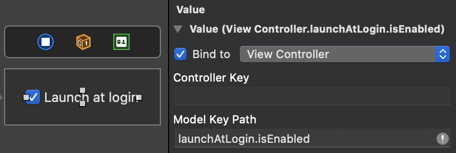

# LaunchAtLogin

> Add “Launch at Login” functionality to your macOS app in seconds

It's usually quite a [convoluted and error-prone process](before-after.md) to add this. **No more!**

This package works with both sandboxed and non-sandboxed apps and it's App Store compatible and used in apps like [Plash](https://github.com/sindresorhus/Plash), [Dato](https://sindresorhus.com/dato), [Lungo](https://sindresorhus.com/lungo), and [Battery Indicator](https://sindresorhus.com/battery-indicator).

<br>

---

<div align="center">
	<p>
		<p>
			<sup>
				<a href="https://github.com/sponsors/sindresorhus">Sindre‘s open source work is supported by the community</a>
			</sup>
		</p>
		<sup>Special thanks to:</sup>
		<br>
		<br>
		<a href="https://keygen.sh">
			<div>
				
			</div>
			<b>A dead-simple software licensing and distribution API built for developers</b>
		</a>
		<br>
		<br>
	</p>
</div>

---

<br>

## Requirements

- macOS 10.12+
- Xcode 12+
- Swift 5.3+

## Install

#### Swift Package Manager

Add `https://github.com/sindresorhus/LaunchAtLogin` in the [“Swift Package Manager” tab in Xcode](https://developer.apple.com/documentation/xcode/adding_package_dependencies_to_your_app).

#### Carthage

*Warning: Carthage is not recommended. Support for it will be removed at some point in the future.*

```
github "sindresorhus/LaunchAtLogin"
```

## Usage

#### Swift Package Manager

Add a new [“Run Script Phase”](http://stackoverflow.com/a/39633955/64949) **below** (not into) “Copy Bundle Resources” in “Build Phases” with the following:

```sh
"${BUILT_PRODUCTS_DIR}/LaunchAtLogin_LaunchAtLogin.bundle/Contents/Resources/copy-helper-swiftpm.sh"
```

*(I would name the run script `Copy “Launch at Login Helper”`)*

#### Carthage

Add a new [“Run Script Phase”](http://stackoverflow.com/a/39633955/64949) **below** (not into) “Embed Frameworks” in “Build Phases” with the following:

```sh
"${PROJECT_DIR}/Carthage/Build/Mac/LaunchAtLogin.framework/Resources/copy-helper.sh"
```

*(I would name the run script `Copy “Launch at Login Helper”`)*

### Use it in your app

No need to store any state to UserDefaults.

*Note that the [Mac App Store guidelines](https://developer.apple.com/app-store/review/guidelines/) requires “launch at login” functionality to be enabled in response to a user action. This is usually solved by making it a preference that is disabled by default. Many apps also let the user activate it in a welcome screen.*

#### As static property

```swift
import LaunchAtLogin

print(LaunchAtLogin.isEnabled)
//=> false

LaunchAtLogin.isEnabled = true

print(LaunchAtLogin.isEnabled)
//=> true
```

#### SwiftUI

This package comes with a `LaunchAtLogin.Toggle` view which is like the built-in `Toggle` but with a predefined binding and label. Clicking the view toggles “launch at login” for your app.

```swift
struct ContentView: View {
	var body: some View {
		LaunchAtLogin.Toggle()
	}
}
```

The default label is `"Launch at login"`, but it can be overridden for localization and other needs:

```swift
struct ContentView: View {
	var body: some View {
		LaunchAtLogin.Toggle {
			Text("Launch at login")
		}
	}
}
```

Alternatively, you can use `LaunchAtLogin.observable` as a binding with `@ObservedObject`:

```swift
import SwiftUI
import LaunchAtLogin

struct ContentView: View {
	@ObservedObject private var launchAtLogin = LaunchAtLogin.observable

	var body: some View {
		Toggle("Launch at login", isOn: $launchAtLogin.isEnabled)
	}
}
```

#### Combine

Just subscribe to `LaunchAtLogin.publisher`:

```swift
import Combine
import LaunchAtLogin

final class ViewModel {
	private var isLaunchAtLoginEnabled = LaunchAtLogin.isEnabled
	private var cancellables = Set<AnyCancellable>()

	func bind() {
		LaunchAtLogin
			.publisher
			.assign(to: \.isLaunchAtLoginEnabled, on: self)
			.store(in: &cancellables)
	}
}
```

#### Storyboards

Bind the control to the `LaunchAtLogin.kvo` exposed property:

```swift
import Cocoa
import LaunchAtLogin

final class ViewController: NSViewController {
	@objc dynamic var launchAtLogin = LaunchAtLogin.kvo
}
```



## How does it work?

The package bundles the helper app needed to launch your app and copies it into your app at build time.

## FAQ

#### I'm getting a “No such file or directory” error when archiving my app

Please ensure that the LaunchAtLogin run script phase is still below the “Embed Frameworks” phase. The order could have been accidentally changed.

The build error usually presents itself as:

```
cp: […]/Resources/LaunchAtLoginHelper.app: No such file or directory
rm: […]/Resources/copy-helper.sh: No such file or directory
Command PhaseScriptExecution failed with a nonzero exit code
```

#### The size of my app increased after adding `LaunchAtLogin` when using Carthage

The bundled launcher app is written in Swift and hence needs to embed the Swift runtime libraries. If your project targets macOS 10.14.4 or later, you can avoid embedding the Swift runtime libraries. First, open `./Carthage/Checkouts/LaunchAtLogin/LaunchAtLogin.xcodeproj` and set the deployment target to the same as your app, and then run `$ carthage build`. You'll have to do this each time you update `LaunchAtLogin`.

This is not a problem when using Swift Package Manager.

#### My app doesn't show up in “System Preferences › Users & Groups › Login Items”

[This is the expected behavior](https://stackoverflow.com/a/15104481/64949), unfortunately.

#### My app doesn't launch at login when testing

This is usually caused by having one or more older builds of your app laying around somewhere on the system, and macOS picking one of those instead, which doesn't have the launch helper, and thus fails to start.

Some things you can try:
- Bump the version & build of your app so macOS is more likely to pick it.
- Delete the [`DerivedData` directory](https://mgrebenets.github.io/mobile%20ci/2015/02/01/xcode-derived-data).
- Ensure you don't have any other builds laying around somewhere.

Some helpful Stack Overflow answers:
- https://stackoverflow.com/a/43281810/64949
- https://stackoverflow.com/a/51683190/64949
- https://stackoverflow.com/a/53110832/64949
- https://stackoverflow.com/a/53110852/64949

#### Can you support CocoaPods?

CocoaPods used to be supported, but [it did not work well](https://github.com/sindresorhus/LaunchAtLogin/issues/22) and there was no easy way to fix it, so support was dropped. Even though you mainly use CocoaPods, you can still use Swift Package Manager just for this package without any problems.

#### I can't see the `LaunchAtLogin.bundle` in my debug build or I get a notarization error for developer ID distribution

As discussed [here](https://github.com/sindresorhus/LaunchAtLogin/issues/50), this package tries to determine if you're making a release or debug build and clean up its install accordingly. If your debug build is missing the bundle or, conversely, your release build has the bundle and it causes a code signing error, that means this has failed.

The script's determination is based on the “Build Active Architecture Only” flag in build settings. If this is set to `YES`, then the script will package LaunchAtLogin for a debug build. You must set this flag to `NO` if you plan on distributing the build with codesigning.

## Related

- [Defaults](https://github.com/sindresorhus/Defaults) - Swifty and modern UserDefaults
- [KeyboardShortcuts](https://github.com/sindresorhus/KeyboardShortcuts) - Add user-customizable global keyboard shortcuts to your macOS app
- [Regex](https://github.com/sindresorhus/Regex) - Swifty regular expressions
- [Preferences](https://github.com/sindresorhus/Preferences) - Add a preferences window to your macOS app in minutes
- [DockProgress](https://github.com/sindresorhus/DockProgress) - Show progress in your app's Dock icon
- [create-dmg](https://github.com/sindresorhus/create-dmg) - Create a good-looking DMG for your macOS app in seconds
- [More…](https://github.com/search?q=user%3Asindresorhus+language%3Aswift)
